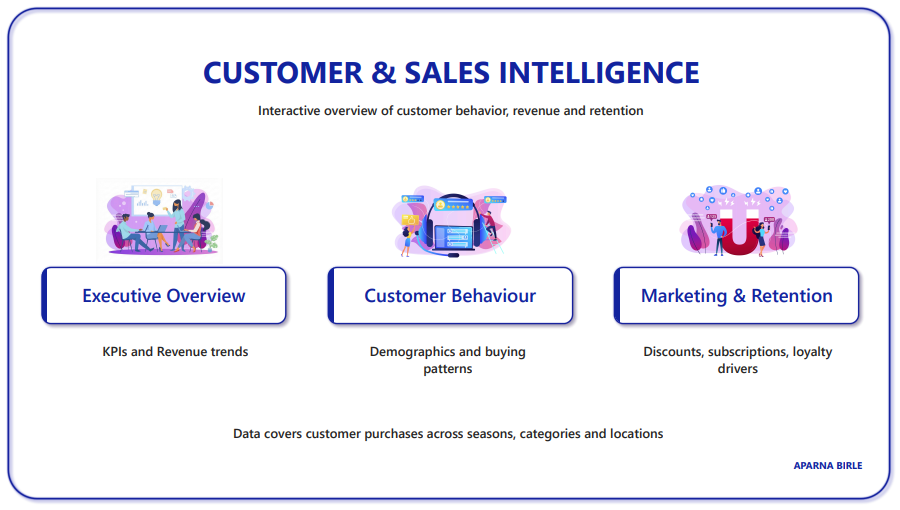
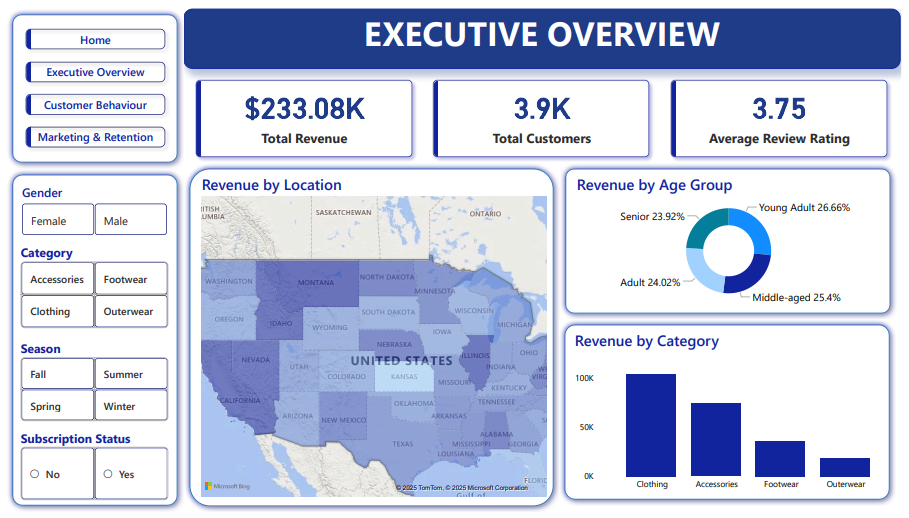
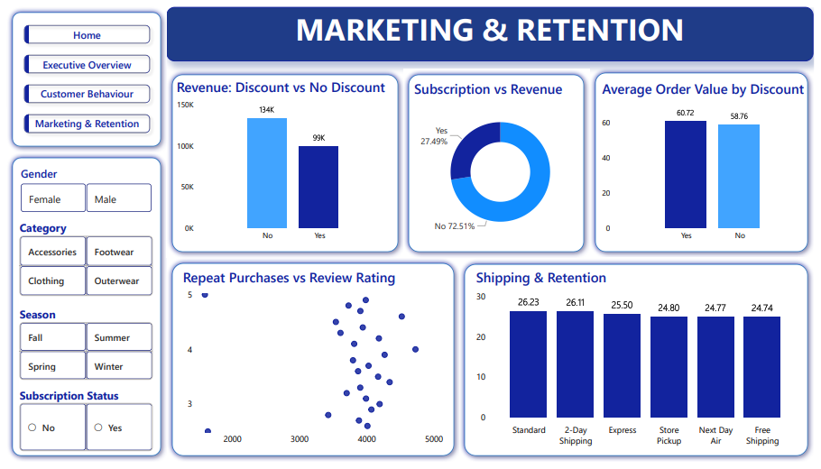

# Customer Shopping Behaviour - Customer & Sales Intelligence

## Project Overview

**Goal:** Understand revenue drivers, discount effectiveness, and subscription impact.

**Tech Stack:**
- Data Preparation: Python (pandas)
- Analytics: SQL Server (CTEs, window functions)
- Visualisation: Power BI (4-page interactive dashboards)
- Presentations: Gamma AI → Google Slides → Video

**Dataset:** 3,900 customer transactions (18 attributes)

---

## Business Questions

1. Who drives revenue across gender, age, and category?
2. Are discounts improving revenue quality or eroding margin?
3. Is the subscription program monetizing loyal customers?
4. How to optimize shipping and payment operations?

---

## Analysis Workflow

### Python - Data Preparation
- Cleaned missing values (37 in review_rating)
- Feature engineering: age_group, purchase_frequency_days
- **[View Code](./Customer_Behaviour.ipynb)**

### SQL - Business Queries
- 10 analytical queries (revenue, discounts, products, segments)
- CTEs, window functions, aggregations
- **[View Queries](./customer.sql)**

### Power BI - Interactive Dashboards
Dashboard includes Home page with navigation to 3 analysis pages:
- **Home** - Project overview with navigation
- **Executive Overview** - KPIs, revenue metrics
- **Customer Behaviour** - Demographics, patterns
- **Marketing & Retention** - Discounts, subscriptions

📥 **[Download Power BI Dashboard](https://drive.google.com/file/d/1ssUXDoD08QnqZbav4bPdnlSltC-HMcx0/view?usp=drive_link)** (Google Drive)

**Dashboard Preview:**

---

## Key Findings

| Insight | Finding |
|---------|---------|
| Revenue by Gender | Male: $157.9K (68%), Female: $75.2K (32%) |
| Top Products | Blouse, Jewellery, Pants |
| Discount Impact | Used on 863 high-value orders, minimal AOV uplift |
| Subscription | 27.5% penetrated, no spend difference |
| Repeat Buyers | 2,518 loyal customers (>5 purchases) not subscribed |

---

## Recommendations

✅ **Revenue Growth:** Age-targeted campaigns, female funnel optimisation  
✅ **Discount Strategy:** Threshold-based discounts, protect high-margin items  
✅ **Subscription:** Position as a loyalty program, convert repeat buyers  
✅ **Operations:** Bundle shipping with subscription, optimise digital payments  

---

## Modern Presentation Workflow

**Gamma AI → Google Slides → Video**

1. Gamma auto-generates slides from insights
2. Google Slides refinement + speaker notes
3. Convert to MP4 video for async sharing

📺 **[Watch Presentation Video](https://drive.google.com/file/d/1S1kUmlECiUGa1SKLEjU81ObbAmVsBFDM/view?usp=drive_link)**

[Complete Methodology](./PRESENTATION_WORKFLOW.md)

---

## 📁 Project Files on GitHub

| File | Purpose |
|------|---------|
| [customer_shopping_behavior.csv](./customer_shopping_behavior.csv) | Full dataset (3,900 rows) |
| [Customer_Behaviour.ipynb](./Customer_Behaviour.ipynb) | Python data cleaning & analysis |
| [customer.sql](./customer.sql) | 10 SQL business queries |
| [PRESENTATION_WORKFLOW.md](./PRESENTATION_WORKFLOW.md) | How to create presentations |

## 📥 External Files

| File | Link | Purpose |
|------|------|---------|
| Customer Behaviour Dashboard.pbix | [Google Drive](https://drive.google.com/file/d/1ssUXDoD08QnqZbav4bPdnlSltC-HMcx0/view?usp=drive_link) | Power BI dashboard |
| Customer Behaviour Video.mp4 | [Google Drive](https://drive.google.com/file/d/1S1kUmlECiUGa1SKLEjU81ObbAmVsBFDM/view?usp=drive_link) | Presentation video |

---

## How to Use

1. **View Analysis:** Open [Customer_Behaviour.ipynb](./Customer_Behaviour.ipynb)
2. **Run Queries:** Execute [customer.sql](./customer.sql) on SQL Server
3. **Explore Dashboard:** 
   - Download from [Google Drive](https://drive.google.com/file/d/1ssUXDoD08QnqZbav4bPdnlSltC-HMcx0/view?usp=drive_link)
   - Open in Power BI Desktop
   - Start from the Home page for navigation
4. **Watch Summary:** 
   - View [Here](https://drive.google.com/file/d/1S1kUmlECiUGa1SKLEjU81ObbAmVsBFDM/view?usp=drive_link) from Google Drive

---

**Last Updated:** December 2025
